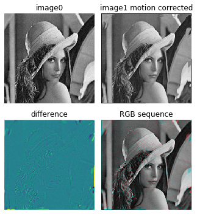

# motion-field-estimation
Motion field estimation based on the gradient constraint equation with iterative refinement

### demo_motion_field_estimation.py 
This demo shows how to estimate motion field between two 2D (single channel) same size images

**Dummy dataset** 
Given rotation angle: -1.16 
Given translation Row: 4.01 Col: 4.29 

  

**After 1 iteration** 
Estimated motion field 

  

Motion correction 

  

**After 2 iteration** 
Estimated motion field 

  

Motion correction 

  

**After 10 iteration** 
Estimated motion field 

  

Motion correction 

  

